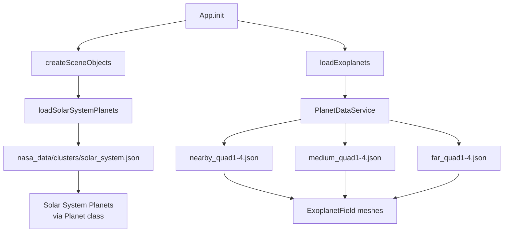

# How to Debug Planet Display Issues

This document provides a comprehensive guide for debugging planet display issues in the Exoplanet Explorer application.

---

## 🐛 Issue Summary

**Observed Problems:**
1. **Planets appear incorrectly on startup** - Some planets are displayed in wrong positions
2. **Solar system planets show 0.0 ly distance** - Earth, Mars, Jupiter always display 0.0 ly regardless of ship position
3. **Large number of duplicate planets** - Console shows: "Deduplicated planets: 10093 → 5251 (removed 4842 duplicates)"
4. **WebGL rendering errors** - `WebGL: INVALID_OPERATION: useProgram: program not valid`

---

## 📍 Key Files to Investigate

| File | Purpose | Key Functions |
|------|---------|---------------|
| [main.js](file:///Users/eduardo.pertierrapuche/Development/Whispers%20Project/Whispers-Backend/agentic-3d-space-exploration-hamburg-ai-hackathon-jan-26/main.js#L326-L362) | App initialization, creates scene objects | `createSceneObjects()`, `loadExoplanets()` |
| [PlanetDataService.js](file:///Users/eduardo.pertierrapuche/Development/Whispers%20Project/Whispers-Backend/agentic-3d-space-exploration-hamburg-ai-hackathon-jan-26/src/services/PlanetDataService.js) | Loads and manages NASA exoplanet cluster data | `loadCluster()`, `enrichPlanetData()`, `getAllPlanets()` |
| [ExoplanetField.js](file:///Users/eduardo.pertierrapuche/Development/Whispers%20Project/Whispers-Backend/agentic-3d-space-exploration-hamburg-ai-hackathon-jan-26/src/objects/ExoplanetField.js) | Renders exoplanets as 3D spheres | `create3DMeshes()`, `removeSolarSystemDuplicates()` |
| [planets.js](file:///Users/eduardo.pertierrapuche/Development/Whispers%20Project/Whispers-Backend/agentic-3d-space-exploration-hamburg-ai-hackathon-jan-26/src/config/planets.js) | Solar system planet configuration | `loadSolarSystemPlanets()` |
| [solar_system.json](file:///Users/eduardo.pertierrapuche/Development/Whispers%20Project/Whispers-Backend/agentic-3d-space-exploration-hamburg-ai-hackathon-jan-26/nasa_data/clusters/solar_system.json) | Solar system planet data | Raw data for planets |

---

## 🔍 Debugging Strategy

### Step 1: Check Browser Console

Open DevTools (F12) and look for:

```
✓ Loaded nearby_quad1: XXX planets
✓ Loaded nearby_quad2: XXX planets
⚠️ Deduplicated planets: X → Y (removed Z duplicates)
✓ NASA exoplanets added to scene
```

> [!WARNING]
> If you see a massive deduplication (e.g., 4000+ duplicates removed), there's likely a race condition in cluster loading or the data files contain duplicate entries.

### Step 2: Inspect Planet Data Sources

The application loads planets from **two sources**:



### Step 3: Check Solar System Data

In [solar_system.json](file:///Users/eduardo.pertierrapuche/Development/Whispers%20Project/Whispers-Backend/agentic-3d-space-exploration-hamburg-ai-hackathon-jan-26/nasa_data/clusters/solar_system.json), notice that solar system planets have:

```json
"coordinates_3d": {
  "x_light_years": null,
  "y_light_years": null,
  "z_light_years": null,
  "system": "Unknown",
  "note": "Coordinates unavailable"
}
```

> [!IMPORTANT]  
> **Root Cause Identified:** Solar system planets have `null` coordinates in `coordinates_3d`, but they DO have a `position` field with x, y, z values in AU (Astronomical Units).

The `enrichPlanetData()` function in `PlanetDataService.js` tries to compute 3D coordinates, but the logic may not correctly handle solar system planets.

### Step 4: Trace the Position Flow

**Solar System Planets Position Flow:**

1. Data loaded from `solar_system.json` with `position: { x: AU, y: AU, z: AU }`
2. In [planets.js:L31-35](file:///Users/eduardo.pertierrapuche/Development/Whispers%20Project/Whispers-Backend/agentic-3d-space-exploration-hamburg-ai-hackathon-jan-26/src/config/planets.js#L31-L35), position is scaled by 200:
   ```javascript
   position: {
       x: p.position.x * 200,  // Scale orbit distance
       y: p.position.y * 200,
       z: p.position.z * 200
   }
   ```
3. Planet is placed at this scaled position

**Exoplanets Position Flow:**

1. Data loaded from cluster JSON files with `characteristics.coordinates_3d`
2. In [ExoplanetField.js:L159-163](file:///Users/eduardo.pertierrapuche/Development/Whispers%20Project/Whispers-Backend/agentic-3d-space-exploration-hamburg-ai-hackathon-jan-26/src/objects/ExoplanetField.js#L159-L163):
   ```javascript
   mesh.position.set(
       coords.x_light_years * this.sceneScale,  // sceneScale = 10
       coords.y_light_years * this.sceneScale,
       coords.z_light_years * this.sceneScale
   );
   ```

---

## 🔧 Potential Root Causes

### Issue 1: Duplicate Solar System Planets

**Location:** [ExoplanetField.js:L91-103](file:///Users/eduardo.pertierrapuche/Development/Whispers%20Project/Whispers-Backend/agentic-3d-space-exploration-hamburg-ai-hackathon-jan-26/src/objects/ExoplanetField.js#L91-L103)

The duplicate detection checks for `hostname === 'Sun'`:
```javascript
if (planet.hostname === 'Sun' && solarSystemPlanets.includes(planet.pl_name)) {
    continue;
}
```

**Debug Steps:**
1. Add console.log to verify solar system planets are being skipped
2. Check if solar system planets exist in other cluster files (nearby_quad*.json)
3. Verify the `removeSolarSystemDuplicates()` function is called AFTER all meshes are created

### Issue 2: 0.0 ly Distance Bug

**Location:** The distance calculation likely uses `coordinates_3d` which is `null` for solar system planets.

**Debug Steps:**
1. Search for distance calculation code
2. Check if it falls back to `position` field when `coordinates_3d` is null
3. Add null checks and fallback logic

### Issue 3: Race Condition in Cluster Loading

**Location:** [ExoplanetField.js:L34-55](file:///Users/eduardo.pertierrapuche/Development/Whispers%20Project/Whispers-Backend/agentic-3d-space-exploration-hamburg-ai-hackathon-jan-26/src/objects/ExoplanetField.js#L34-L55)

The loading sequence is:
1. `loadNearbyFirst()` - async
2. `create3DMeshes()` - called immediately
3. `loadClustersProgressively()` - starts in background
4. `removeSolarSystemDuplicates()` - called once after step 2

**Problem:** If `removeSolarSystemDuplicates()` is called before all clusters finish loading, duplicates from later clusters won't be removed.

---

## 🧪 Debug Commands (Browser Console)

### List All Planets in Scene
```javascript
window.app.planets.map(p => ({
    name: p.config.name,
    position: p.group.position.toArray(),
    isSolar: p.config.isSolar
}));
```

### Check Exoplanet Field Stats
```javascript
console.log('Total exoplanets:', window.app.exoplanetField.planets.length);
console.log('Rendered planets:', window.app.exoplanetField.renderedPlanets.size);
```

### Find Planets Near Origin
```javascript
window.app.sceneManager.scene.traverse(obj => {
    if (obj.userData?.planetData && obj.position.length() < 50) {
        console.log('Near origin:', obj.userData.planetData.pl_name, obj.position);
    }
});
```

### Check PlanetDataService Stats
```javascript
window.app.planetDataService.getStats();
```

---

## 🛠️ Suggested Fixes (DO NOT IMPLEMENT - Documentation Only)

### Fix 1: Solar System Coordinate Handling
In `enrichPlanetData()`, add special handling for solar system planets:
- Detect `hostname === 'Sun'`
- Use `position` field instead of computing from RA/Dec
- Apply consistent scaling with `loadSolarSystemPlanets()`

### Fix 2: Timing of Duplicate Removal
Move `removeSolarSystemDuplicates()` call to:
- After each cluster batch is rendered, OR
- Use an event/callback when all clusters finish loading

### Fix 3: Distance Calculation
Add fallback in distance display:
- If `coordinates_3d` is null, calculate from `position` field
- Handle solar system planets separately (distances in AU, not light-years)

---

## 📊 Data Flow Diagram

```mermaid
sequenceDiagram
    participant A as App.init()
    participant S as SceneManager
    participant P as loadSolarSystemPlanets()
    participant D as PlanetDataService
    participant E as ExoplanetField
    
    A->>S: Create scene
    A->>P: Load solar_system.json
    P->>S: Add Planet meshes (scaled x200)
    A->>D: Initialize
    D->>D: Load cluster_index.json
    A->>E: Create ExoplanetField
    E->>D: loadNearbyFirst()
    D->>D: Load nearby_quad1-4.json
    E->>S: Create 3D meshes (scaled x10)
    E->>E: removeSolarSystemDuplicates()
    E-->>D: loadClustersProgressively() (background)
    D->>D: Load medium, far, veryfar clusters
    E->>S: Add more meshes
    Note over E: ⚠️ Duplicates may appear here!
```



---

## 📝 Checklist for Debugging

- [ ] Open browser DevTools console
- [ ] Check for "Deduplicated planets" warnings
- [ ] Count solar system planets in scene vs expected (8-9)
- [ ] Verify solar system planets have correct positions (not at origin)
- [ ] Check distance display for solar system planets
- [ ] Look for WebGL errors
- [ ] Verify cluster loading completes without errors
- [ ] Test duplicate removal timing

---

## 🔗 Related Files

- Cluster data: `nasa_data/clusters/` directory
- Cluster index: `nasa_data/clusters/cluster_index.json`
- Planet textures: `src/utils/textureGenerator.js`
- Planet selector UI: `src/controls/PlanetSelector.js`
- Teleport manager: `src/utils/TeleportManager.js`
